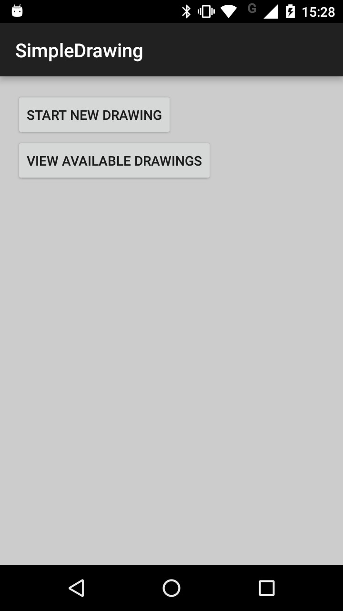
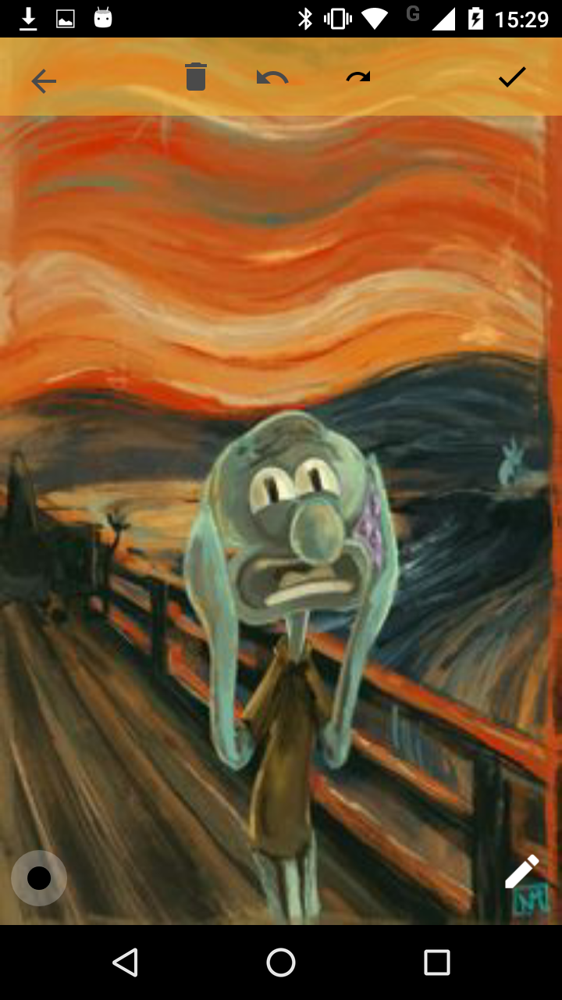
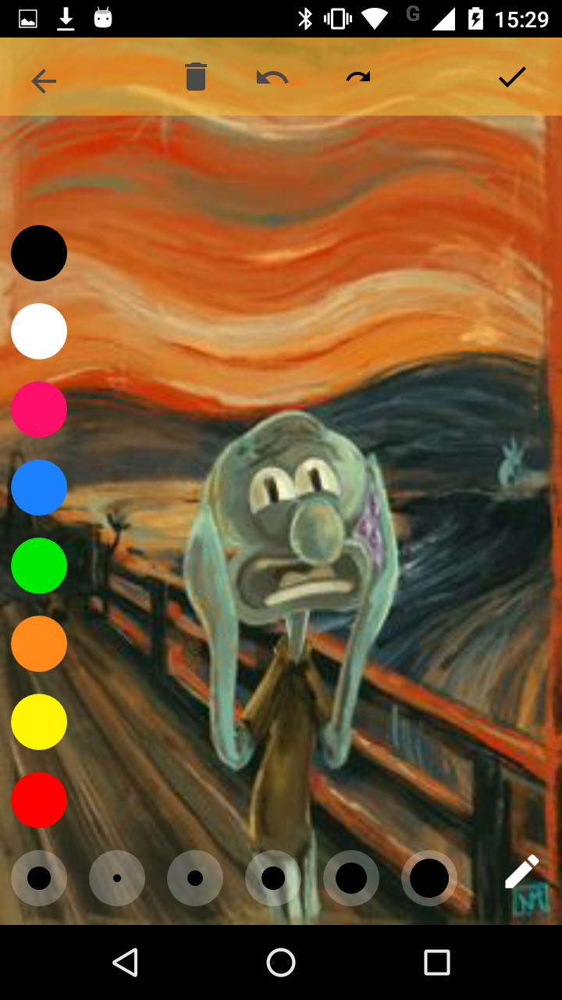
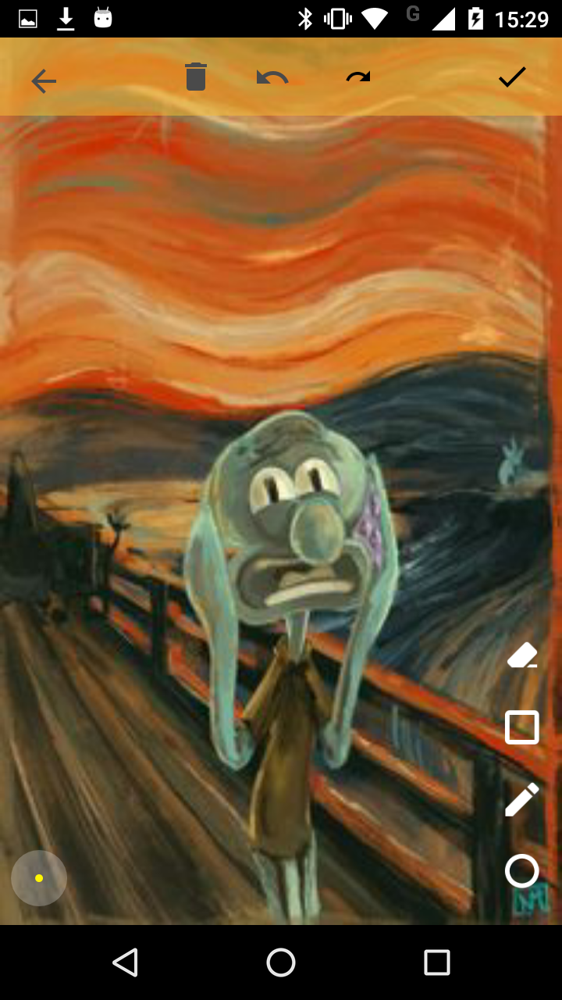
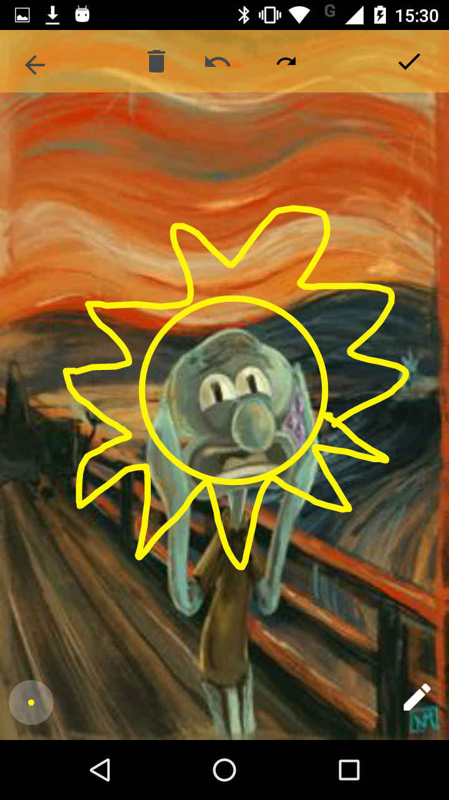
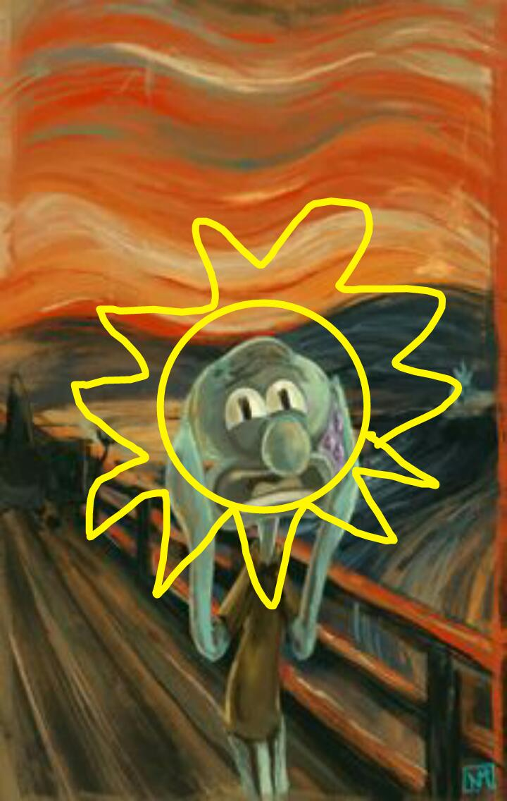

Simple Drawing Android
=============

This simple drawing app you can draw on top of a picture choose from galley or a new photo (TODO). Also can save the edited drawing.

Reference
=============
[Create a Drawing App on Android](http://code.tutsplus.com/series/create-a-drawing-app-on-android--cms-704)
[Basic Painting with Views](https://github.com/codepath/android_guides/wiki/Basic-Painting-with-Views)